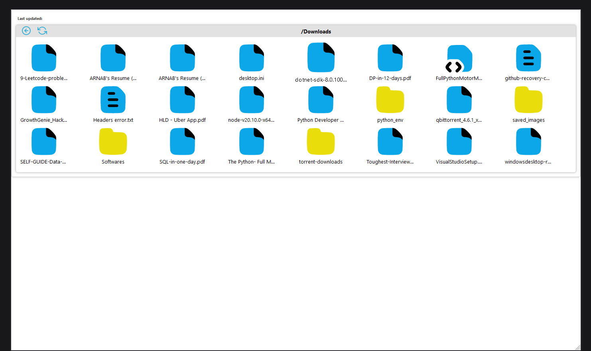

## FileVista

**Description:** A simple directory browser built with React. Allows you to browse through a directory structure and view files. Back-end is built with Node.js and Express.

## Installation

1. Clone the repository
2. Navigate to the backend directory and run `npm install`
3. Navigate to the frontend directory and run `npm install` (make sure to navigate inside `dir_browser_ui` directory)
4. Run `npm start` in the backend directory
5. Run `npm start` in the frontend directory

## Usage

1. Navigate to `localhost:3000` in your browser
2. Click on a directory to view its contents

## Screenshots

